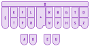

# Lição 1: Introdução

A estenotipia é uma técnica de digitação ultrarrápida usada para registrar a fala em tempo real que, por meio de combinações de teclas e abreviações, permite que alguém escreva a até 200 palavras por minuto. Ela é amplamente utilizada para a produção do *closed caption* ao vivo na TV aberta, assim como em serviços de transcrição.

Graças aos [Plover](https://opensteno.org/) a aos esforços da comunidade, a estenotipia não é mais restrita aos profissionais, podendo ser aprendida por **qualquer um** em um teclado convencional com um software gratuito e de código aberto.

## Como a estenotipia funciona?

  

Antes de entrarmos em detalhes, vamos pensar em como digitamos normalmente. Se você fosse escrever a palavra "contratado", provavelmente digitaria assim:

cada letra é pressionada individualmente:
```
c/o/n/t/r/a/t/a/d/o
```

> A barra indica os toques individuais às teclas

Isso resulta em 10 toques sucessivos. Por outro lado, na estenotipia pressionamos múltiplas teclas ao mesmo tempo, permitindo digitar sílabas, palavras, e até frases inteiras com um único toque. Usando combinações de teclas conseguimos digitar a palavra "contratado" com um único toque:

```
KTRATD
```