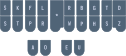
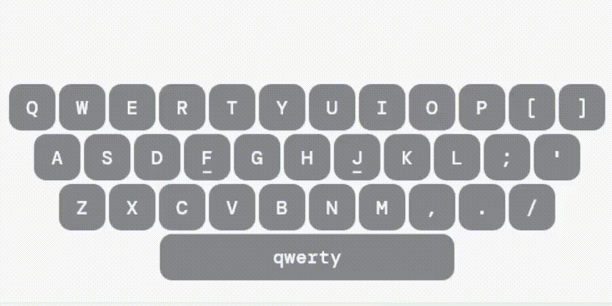

# Lição 1: Introdução

A estenotipia é uma técnica de digitação ultrarrápida usada para registrar a fala em tempo real que, por meio de combinações de teclas e abreviações, permite que alguém escreva a até 200 palavras por minuto. Ela é amplamente utilizada para a produção do *closed caption* ao vivo na TV aberta, assim como em serviços de transcrição.

Graças aos [Plover](https://opensteno.org/) a aos esforços da comunidade, a estenotipia não é mais restrita aos profissionais, podendo ser aprendida por **qualquer um** em um teclado convencional com um software gratuito e de código aberto.

## Como a estenotipia funciona?



Antes de entrarmos em detalhes, vamos pensar em como digitamos normalmente. Se você fosse escrever a palavra "contratado", provavelmente digitaria assim:



cada letra é pressionada individualmente:
```
c/o/n/t/r/a/t/a/d/o
```

> A barra indica os toques individuais às teclas

Isso resulta em 10 toques sucessivos. Por outro lado, na estenotipia pressionamos múltiplas teclas ao mesmo tempo, permitindo digitar sílabas, palavras, e até frases inteiras com um único toque. Usando os princípios que serão ensinados nas próximas lições, podemos combinar teclas para digitar a palavra "contratado" com um único toque:

```
KTRATD
```


### Letras faltando

Como você pode perceber, há várias letras faltando no teclado. Para representar o restante das letras, a estenotipia usa combinações específicas de teclas (que serão ensinadas em lições futuras). Por exemplo, se quisermos escrever a palavra "boneco", faremos assim:

```
TPLREPH
```


À primeira vista, pode parecer um monte de letras aleatórias, mas cada combinação representa uma letra. No nosso exemplo, `TP` representa a letra B inicial; `LR` representa a letra N inicial; e `PH` representa o som da letra C final.

Essencialmente, `TPLREPH` é apenas uma outra forma de escrever `BNEC`(boneco)

### Vogais faltando

Vendo os exemplos apresentados, você pode ter percebido também que algumas vogais estão faltando. A fim de poupar toques, as vogais átonas são omitidas sempre que possível. A palavra "boneco" tem a ênfase na segunda sílaba (pronunciamos a palavra "boneco" como bo**NÉ**co) então as vogais O na primeira e última sílaba são omitidas (b<del>o</del>nec<del>o</del>)

> A vogal tônica (que tem a ênfase) não pode ser omitida

Quando a disposição das teclas não permitir a omissão de todas as vogais átonas (seja por ser uma palavra grande, com préfixos, sufixos, múltiplos radicais, etc...), a palavra é dividida em múltiplos toques, podemos assim escrever a palavra "chocolate":

```
SLROPH/LAT
```


> SLROPH (choco)


> LAT (late)

SLR representa o CH inicial; e PH representa o C final. 

Representando as letras que faltam com combinações, omitindo as vogais átonas e dividindo a palavra conforme for necessário, o estenotipista consegue escrever qualquer palavra, mesmo que nunca tenha a escrito anteriormente.

Abaixo está uma demonstração de como a estenotipia se parece a 200 palavras por minuto:

> Estou trabalhando nisso ainda

## Conclusão

Espero que depois dessa lição você tenha uma ideia melhor do que é a estenotipia. Infelizmente não dá para se profundar tanto numa introdução, então caso tenha alguma dúvida, ela provavelmente será esclarecida em alguma lição futura. 

Na próxima lição veremos o setup para começar a estenotipar.